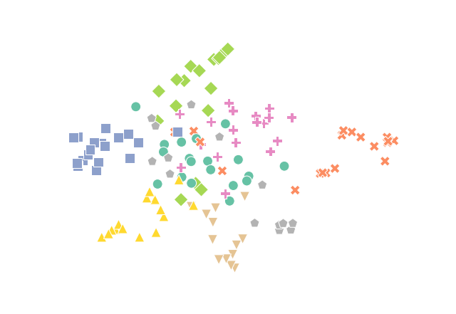

# Symbolic node embedding

This framework offers a symbolic alternative to black-box embedding of nodes.
It is competitive on large graphs, especially when we are interested in a certain subgraph.



If you use the code from this repo, please cite:

```
@InProceedings{10.1007/978-3-030-33778-0_21,
author="{\v{S}}krlj, Bla{\v{z}}
and Lavra{\v{c}}, Nada
and Kralj, Jan",
editor="Kralj Novak, Petra
and {\v{S}}muc, Tomislav
and D{\v{z}}eroski, Sa{\v{s}}o",
title="Symbolic Graph Embedding Using Frequent Pattern Mining",
booktitle="Discovery Science",
year="2019",
publisher="Springer International Publishing",
address="Cham",
pages="261--275",
abstract="Relational data mining is becoming ubiquitous in many fields of study. It offers insights into behaviour of complex, real-world systems which cannot be modeled directly using propositional learning. We propose Symbolic Graph Embedding (SGE), an algorithm aimed to learn symbolic node representations. Built on the ideas from the field of inductive logic programming, SGE first samples a given node's neighborhood and interprets it as a transaction database, which is used for frequent pattern mining to identify logical conjuncts of items that co-occur frequently in a given context. Such patterns are in this work used as features to represent individual nodes, yielding interpretable, symbolic node embeddings. The proposed SGE approach on a venue classification task outperforms shallow node embedding methods such as DeepWalk, and performs similarly to metapath2vec, a black-box representation learner that can exploit node and edge types in a given graph. The proposed SGE approach performs especially well when small amounts of data are used for learning, scales to graphs with millions of nodes and edges, and can be run on an of-the-shelf laptop.",
isbn="978-3-030-33778-0"
}
```